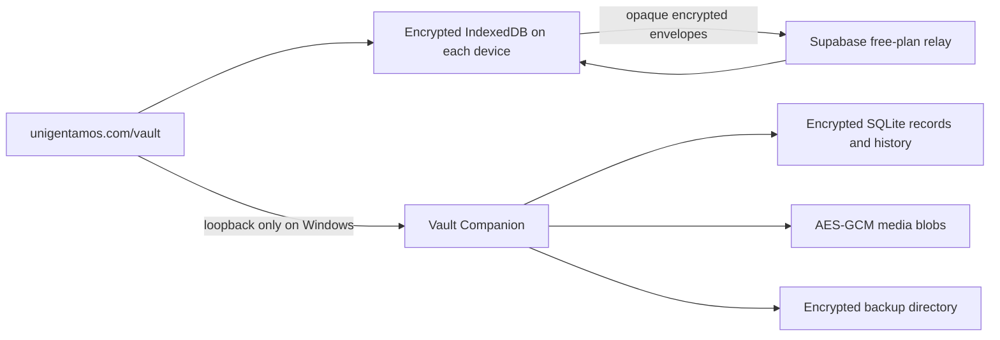

# Local-First Vault Architecture

## Decision

Unigentamos uses a local-first encrypted vault with the Windows desktop as the master device. The normal interface remains `https://unigentamos.com/vault`. A small companion process runs invisibly on the desktop at loopback only; it supplies durable SQLite and encrypted-file storage that a hosted website cannot safely or reliably obtain from a browser alone.

The iPhone, iPad, and MacBook retain encrypted text, metadata, and version history in their browser storage. The desktop retains the same records plus the full encrypted media library. Secondary-device media is selective and on demand; full media-relay transport is not part of this release.

## Data flow

Supabase is a replaceable mailbox, not the source of truth and not a key holder. It stores bounded opaque envelopes plus routing metadata. GitHub contains application code and schema only; it must never contain vault content, passwords, recovery packages, service-role credentials, or unwrapped keys.

## Keys and encryption

- Setup creates a random 256-bit vault key.
- The Windows companion wraps that key with Argon2id using the vault password.
- Browser recovery packages wrap the same key with PBKDF2-SHA-256 at 600,000 iterations for Web Crypto compatibility.
- Record snapshots, change history, and media content use AES-256-GCM authenticated encryption.
- The unwrapped key exists only in memory while the vault is unlocked and is cleared on lock or shutdown.
- The single vault password is not recoverable. Keep at least two offline copies of the encrypted recovery package in physically separate places.

Encryption greatly reduces exposure, but no design is literally impossible to hack. Malware running as the Windows user, a compromised unlocked browser session, a weak or disclosed password, or compromised application code can still expose unlocked data. The design protects data at rest, in the relay, in backups, and in source control; it does not make a compromised active device trustworthy.

## Saves, sync, clocks, and conflicts

Every save first creates an encrypted local version and queues it for relay and desktop mirroring. Network or companion failure does not discard the save. Sync retries every two seconds while the vault is unlocked and online.

Each field carries a hybrid logical clock. When online, server time is checked before saves and used to correct a bad device clock. A two-minute difference produces a warning; a fifteen-minute difference produces a blocked clock state while authenticated server time remains the ordering source. Offline work continues from the last known correction and monotonic counter, but a badly wrong clock should be fixed before long offline periods.

On reconnection:

- changes to different fields merge automatically;
- non-overlapping line edits in note content merge automatically;
- overlapping edits use the newest corrected hybrid clock;
- the losing branch remains encrypted in version history and the conflict ledger;
- a merge version records both the local and remote parent versions;
- Finance and other high-integrity overlaps receive a distinct conflict classification so they are never mistaken for an ordinary clean merge.

## Current implementation boundary

The Vault workspace is local-first for Notes, Contacts, and Resources, including editing and version browsing. Existing online mutations in Notes, People, Resources, Media, Personal Records, and Finance also create an encrypted local mirror when the vault is unlocked in that browser session.

The older dashboard modules have not all been made offline-editable. Their existing Supabase-backed APIs remain canonical for their specialized validation, authorization, audits, Finance invariants, and cross-module ownership rules. Bootstrap can import their current state into encrypted history without mutating production records. This prevents a risky destructive migration while the remaining domain editors move to local-first commands one at a time.

The desktop companion already stores encrypted media and can return it by digest to the approved site. A user-facing media ingest/on-demand transfer workflow for secondary devices remains future work. Until it exists, do not treat mobile media as fully available offline.

## Relay and scale

The additive `vault_sync_changes` table is append-only in this release. Its payload is encrypted, accessible only through the authenticated server route, and protected by CSRF validation on writes. The route measures the actual streamed request body rather than trusting `Content-Length`. A transaction-serialized database trigger caps each vault at 200,000 envelopes or 192 MiB of declared ciphertext, whichever comes first, retaining room for indexes and database maintenance. When the mailbox reaches that ceiling, new changes remain queued on-device and the user sees a storage-limit error; the relay never acknowledges and discards them.

Encrypted checkpoints, device acknowledgements, and safe compaction are still required before the relay can operate indefinitely without manual capacity management. The desktop archive remains usable if the relay is full, unavailable, or later replaced.

Text and metadata volume is appropriate for SQLite and IndexedDB. Large media belongs in encrypted desktop files, not Postgres rows or mobile browser storage. Free Supabase limits are a practical relay constraint, not a data-loss boundary; queued local changes remain on-device when the relay is unavailable.

## Backups and recovery

The companion backup copies the SQLite database and encrypted media tree as one encrypted backup set. By default it writes beside the local vault, which protects against application-level damage but not disk failure. Reinstall with `-BackupDirectory` as soon as an external SSD is available. A future server rack can use the same directory format without changing vault encryption. The default retention boundary is three backup sets; the companion stops and asks for capacity rather than deleting old backups. Move an older, restore-tested set out of the configured directory to free a slot.

Required recovery practice:

1. Export the recovery package after setup.
2. Store two offline copies separately from the desktop.
3. Create an encrypted backup after meaningful work and before application upgrades.
4. Test recovery on a spare local profile or isolated machine before relying on it.
5. Never commit the recovery package, vault data, password, or `.env` files.

Losing the vault password and all recovery material makes the encrypted data permanently unreadable. A backup that has never been restored in a test is not yet a verified backup.
