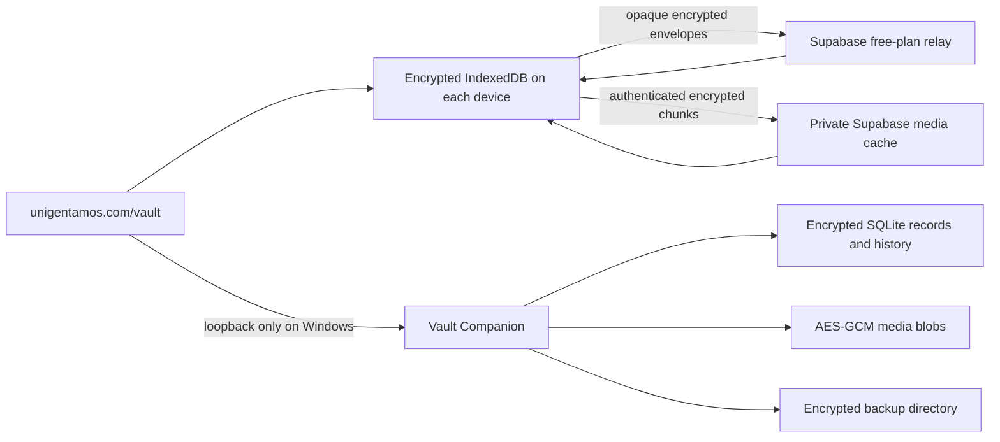

# Local-First Vault Architecture

## Decision

Unigentamos uses a local-first encrypted vault with the Windows desktop as the master device. The normal interface remains `https://unigentamos.com/vault`. A small companion process runs invisibly on the desktop at loopback only; it supplies durable SQLite and encrypted-file storage that a hosted website cannot safely or reliably obtain from a browser alone.

The iPhone, iPad, and MacBook retain encrypted text, metadata, and version history in their browser storage. The desktop retains the same records plus the full encrypted media library. Secondary-device media is selective and on demand: encrypted chunks are cached on a device only when a file is added or opened, and an Apple-originated file is copied into the Windows master library the first time Windows opens it.

## Device setup

On Windows, open `https://unigentamos.com/vault`, choose **Windows desktop**, and use **Check this desktop**. If the browser requests local-network access, allow it so the hosted page can reach the loopback-only companion. Choose **Show pairing code** to open the companion's local page, or find **Unigentamos Vault Companion** in the Windows Start menu. Enter the six-digit code, choose a vault password of at least 14 characters, and create the master vault.

On iPhone, iPad, or MacBook, no companion is installed. Sign into Unigentamos in that browser so live relay sync is authorized. First unlock the Windows vault and export its encrypted recovery file from **Protect the vault**. Move that file with AirDrop, iCloud Drive, or the Files app. On the Apple device, open the Vault page, select the Apple-device path, choose the recovery file, and enter the same vault password. After connection, Safari can install the site with **Share → Add to Home Screen** on iPhone/iPad or **File → Add to Dock** on Mac.

## Data flow

Supabase is a replaceable mailbox, not the source of truth and not a key holder. It stores bounded opaque envelopes plus routing metadata. GitHub contains application code and schema only; it must never contain vault content, passwords, recovery packages, service-role credentials, or unwrapped keys.

## Keys and encryption

- Setup creates a random 256-bit vault key.
- The Windows companion wraps that key with Argon2id using the vault password.
- Browser recovery packages wrap the same key with PBKDF2-SHA-256 at 600,000 iterations for Web Crypto compatibility.
- Record snapshots, change history, and media content use AES-256-GCM authenticated encryption.
- The unwrapped key exists only in memory while the vault is unlocked and is cleared on lock or shutdown.
- The single vault password is not recoverable. Keep at least two offline copies of the encrypted recovery package in physically separate places.

Encryption greatly reduces exposure, but no design is literally impossible to hack. Malware running as the Windows user, a compromised unlocked browser session, a weak or disclosed password, or compromised application code can still expose unlocked data. The design protects data at rest, in the relay, in backups, and in source control; it does not make a compromised active device trustworthy.

## Saves, sync, clocks, and conflicts

Every save first creates an encrypted local version and queues it for relay and desktop mirroring. Network or companion failure does not discard the save. Sync retries every two seconds while the vault is unlocked and online.

Each unlocked browser also publishes a bounded sync acknowledgement at most every 30 seconds and immediately after material sync work. The acknowledgement contains the last relay sequence safely applied, queued and quarantined change counts, and a vault-key-encrypted device descriptor. Device names and kinds are therefore unreadable to Supabase. The **Devices & sync status** panel reports a device as current only when it has applied the relay head and has no queued or quarantined changes. Browsers that have not opened recently remain visible as inactive instead of being silently treated as synchronized. Safari and an installed Home Screen web app are separate local device stores and appear separately.

Each device asks its browser for persistent storage and reports whether that protection was granted, along with approximate local usage and quota. A removed device is retired explicitly: it no longer blocks safe relay cleanup and its old browser cannot resume publishing changes. Retirement removes the device from sync only; it does not remotely erase that device's encrypted local copy. Reconnecting it creates a fresh device identity.

Each field carries a hybrid logical clock. When online, server time is checked before saves and used to correct a bad device clock. A two-minute difference produces a warning; a fifteen-minute difference produces a blocked clock state while authenticated server time remains the ordering source. Offline work continues from the last known correction and monotonic counter, but a badly wrong clock should be fixed before long offline periods.

On reconnection:

- changes to different fields merge automatically;
- non-overlapping line edits in note content merge automatically;
- overlapping edits use the newest corrected hybrid clock;
- the losing branch remains encrypted in version history and the conflict ledger;
- a merge version records both the local and remote parent versions;
- Finance and other high-integrity overlaps receive a distinct conflict classification so they are never mistaken for an ordinary clean merge.

## Current implementation boundary

The Vault workspace is local-first for Notes, Contacts, and Resources, including editing, complete version browsing, and restore-as-a-new-version. Projects, Personal Ops, Reviews, Finance, Media, and other mirrored records are also browsable and restorable without deleting their later history. Existing online mutations in Notes, People, Resources, Media, Personal Records, and Finance create an encrypted local mirror when the vault is unlocked in that browser session.

The older dashboard modules have not all been made offline-editable. Their existing Supabase-backed APIs remain canonical for their specialized validation, authorization, audits, Finance invariants, and cross-module ownership rules. Bootstrap can import their current state into encrypted history without mutating production records. This prevents a risky destructive migration while the remaining domain editors move to local-first commands one at a time.

The Vault page accepts files up to 256 MiB, encrypts them in 1.5 MB plaintext chunks before relay upload, and stores only ciphertext in IndexedDB and the private Supabase Storage bucket. Windows also stores an authenticated encrypted local copy. Secondary devices download and decrypt a file only when it is opened; previously opened ciphertext remains available to that device offline. Media that has never been opened on a secondary device is not promised offline there. If free relay storage is temporarily unavailable, the record and encrypted local/Windows copies remain visible and upload retries later.

## Relay and scale

The additive `vault_sync_changes` table is a bounded encrypted mailbox. Its payload is accessible only through the authenticated server route, and writes and maintenance commands require CSRF validation. Routes measure the actual streamed request body rather than trusting `Content-Length`. A transaction-serialized database trigger caps each vault at 200,000 envelopes or 192 MiB of declared ciphertext, whichever comes first, retaining room for indexes and database maintenance. When the mailbox reaches that ceiling, new changes remain queued on-device and the user sees a storage-limit error; the relay never acknowledges and discards them.

The Windows master can now perform acknowledgement-gated semantic compaction. Cleanup runs only when every active device reports no queued or quarantined changes, uses the minimum active-device acknowledgement as the safe cursor, and preserves the first envelope, the latest 256 acknowledged envelopes, every locally meaningful version, and every current object version. It records a server-only receipt for each cleanup. Compaction never deletes the encrypted SQLite archive or browser version history. If any active device is behind, cleanup returns without deleting anything.

This removes redundant relay traffic without pretending the mailbox is the permanent archive. If meaningful history itself approaches the relay cap, a future bundled checkpoint or relay replacement may still be needed. The desktop archive remains usable if the relay is full, unavailable, or later replaced.

Text and metadata volume is appropriate for SQLite and IndexedDB. Large media belongs in encrypted desktop files, not Postgres rows or full mobile-library replication. The `vault-media-relay` bucket is private, accepts only bounded JSON ciphertext chunks through the authenticated server route, and has no anonymous or authenticated browser policies. Free Supabase limits are a practical relay constraint, not a data-loss boundary; queued local changes and encrypted media remain on-device when the relay is unavailable.

## Backups and recovery

The companion backup copies the SQLite database and encrypted media tree as one encrypted backup set. Each set includes a vault-key-signed manifest with the database and every media file's path, size, and SHA-256 digest. The Vault page lists backups, verifies every file before recovery, previews the exact number of missing versions and media files, requires a typed confirmation, and records a restore receipt. Restore is additive: missing encrypted versions, envelopes, current-object pointers, and media files are inserted without deleting data or overwriting a newer current record. Repeating the same restore is idempotent.

By default backups are written beside the local vault, which protects against application-level damage but not disk failure. While Windows is unlocked, the companion checks hourly and creates a signed, verified backup when the configured cadence is due; the default cadence is seven days. Reinstall with `-BackupDirectory` as soon as an external SSD is available. A future server rack can use the same directory format without changing vault encryption. The default retention boundary is three backup sets; the companion stops and shows an attention item rather than deleting old backups. Move an older, restore-tested set out of the configured directory to free a slot.

Required recovery practice:

1. Export the recovery package after setup.
2. Store two offline copies separately from the desktop.
3. Create an encrypted backup after meaningful work and before application upgrades.
4. Test recovery on a spare local profile or isolated machine before relying on it.
5. Never commit the recovery package, vault data, password, or `.env` files.

Losing the vault password and all recovery material makes the encrypted data permanently unreadable. A backup that has never been restored in a test is not yet a verified backup.
